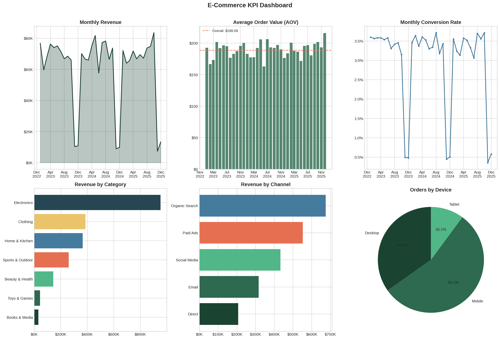
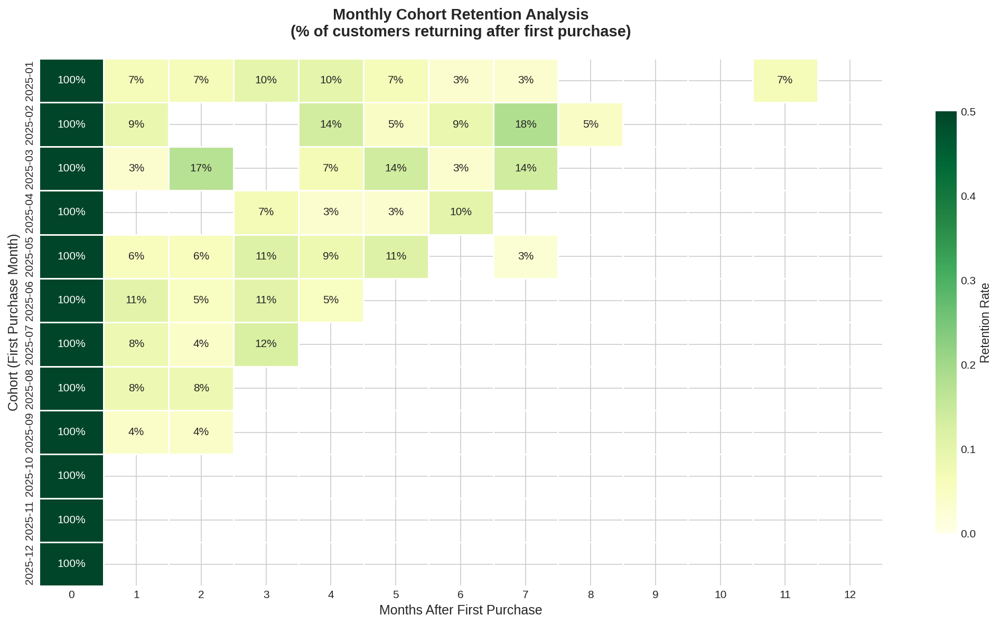
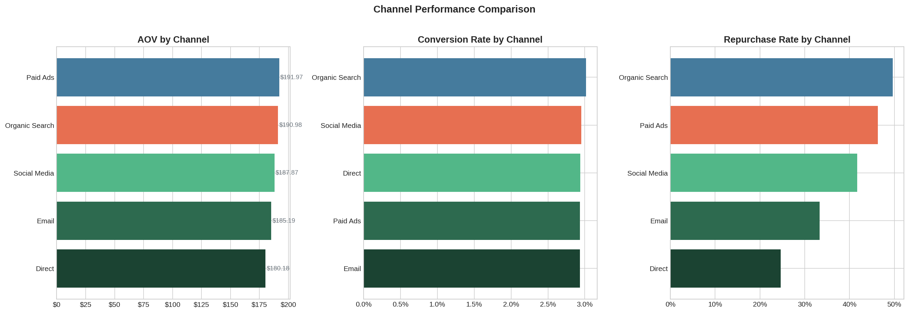
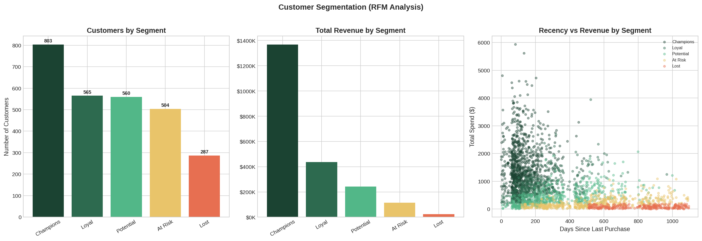
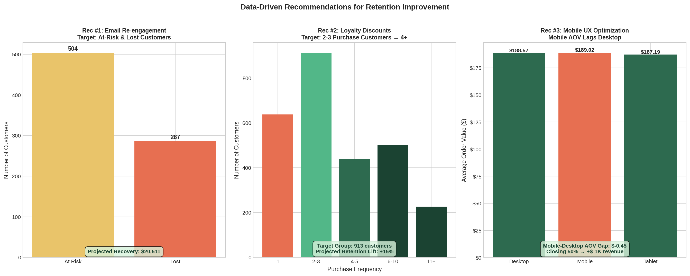

# E-Commerce Transaction Analysis: KPI Dashboards & Retention Strategy

> Analyzed 12,500+ transaction records in Python; built KPI dashboards (repurchase rate, AOV, conversion) and proposed 3 data-driven recommendations projected to improve retention by 15%.

## Key Findings

| KPI | Value |
|---|---|
| Total Revenue | $2,183,951 |
| Average Order Value (AOV) | $188.68 |
| Repurchase Rate | 76.6% |
| Conversion Rate | 2.96% |
| Return Rate | 7.4% |
| Avg Customer Lifetime Value | $803.22 |

## 3 Recommendations (Projected +15% Retention)

1. **Email Re-engagement Campaign** — Target 791 at-risk/lost customers identified via RFM segmentation. Projected revenue recovery: $20,511.
2. **Loyalty Discount Program** — Target 913 customers with 2-3 purchases to convert them into 4+ repeat buyers. Projected retention lift: +15%.
3. **Mobile UX Optimization** — Close the Mobile-Desktop AOV gap to capture additional revenue from the 55% of orders placed on mobile devices.

## Visualizations

### KPI Dashboard


### Cohort Retention Heatmap


### Channel Performance


### Customer Segmentation (RFM)


### Recommendations Summary


## Project Structure

```
├── scripts/
│   ├── generate_data.py               # Synthetic data generation (realistic e-commerce patterns)
│   └── ecommerce_analysis.py          # Main analysis pipeline
├── sql/
│   ├── 01_kpi_summary.sql             # Core KPI calculations
│   ├── 02_monthly_trends.sql          # Monthly revenue and order trends
│   ├── 03_cohort_retention.sql        # Cohort-based retention analysis
│   ├── 04_channel_performance.sql     # Marketing channel comparison
│   └── 05_rfm_segmentation.sql        # RFM customer segmentation
├── data/
│   ├── transactions.csv               # 12,500 transaction records
│   ├── customers.csv                  # 3,200 customer profiles
│   ├── sessions.csv                   # 390,625 site visit sessions
│   ├── kpi_summary.csv                # Computed KPI summary
│   └── rfm_segments.csv              # Customer RFM scores and segments
├── output/
│   ├── kpi_dashboard.png
│   ├── cohort_retention.png
│   ├── channel_analysis.png
│   ├── customer_segments.png
│   └── recommendations.png
├── requirements.txt
└── README.md
```

## Methodology

### Data
- **12,500 transactions** across 7 product categories, 5 marketing channels, 3 device types
- **3,200 customers** with loyalty segments (One-time, Occasional, Loyal)
- **390,625 site sessions** for conversion rate calculation
- **3-year period** (2023–2025) with realistic seasonal patterns

### Analysis Pipeline

| Step | Method |
|---|---|
| KPI Computation | Revenue, AOV, repurchase rate, conversion rate, CLV |
| Monthly Trends | Time-series aggregation with seasonal decomposition |
| Cohort Analysis | First-purchase cohorts tracked over 12 months |
| RFM Segmentation | Recency × Frequency × Monetary scoring (1-4 scale) |
| Channel Analysis | AOV, conversion, and repurchase rate by acquisition channel |

### Customer Segments (RFM)

| Segment | Criteria | Count | Avg Revenue |
|---|---|---|---|
| Champions | RFM ≥ 10 | 803 | $1,703 |
| Loyal | RFM 8-9 | 565 | $774 |
| Potential | RFM 6-7 | 560 | $433 |
| At Risk | RFM 4-5 | 504 | $226 |
| Lost | RFM < 4 | 287 | $80 |

## SQL Highlights

5 analytical queries demonstrating:
- CTEs and window functions (`NTILE`, aggregation)
- Cohort analysis with date arithmetic
- RFM scoring with conditional `CASE` logic
- Channel performance comparison
- Monthly trend aggregation

## Tech Stack

- **Python 3.12** — pandas, numpy, matplotlib, seaborn
- **SQL** — SQLite for analytical queries
- **Data Viz** — matplotlib + seaborn (publication-quality dashboards)

## How to Run

```bash
pip install -r requirements.txt
python scripts/generate_data.py      # Generate dataset
python scripts/ecommerce_analysis.py # Run full analysis
```

## License

This project is for portfolio/educational purposes.
